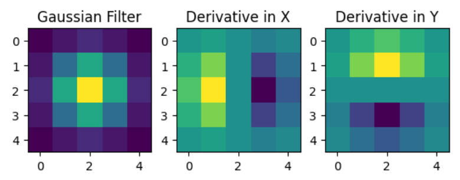
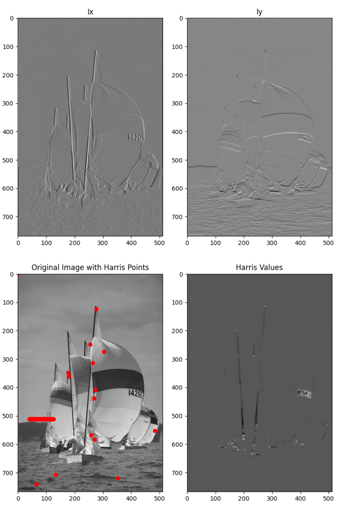

# Harris Detector

In this project, we implemented a function for Harris corner point detection at a fixed scale.

Specifically, we first implemented a function to generate gaussian filter and derivative of gaussian given the size and std. Next, we implemented a function to find Harris corner point following H = Det(A) − α* Trace(A)^2.

The results are as below:

Finally, we test our function on an image by visualizing Ix, Iy, Harris corner point and Harris values for the entire image. The detected Harris corner points are as below:

