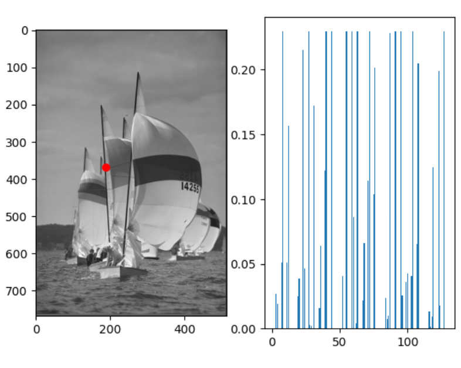
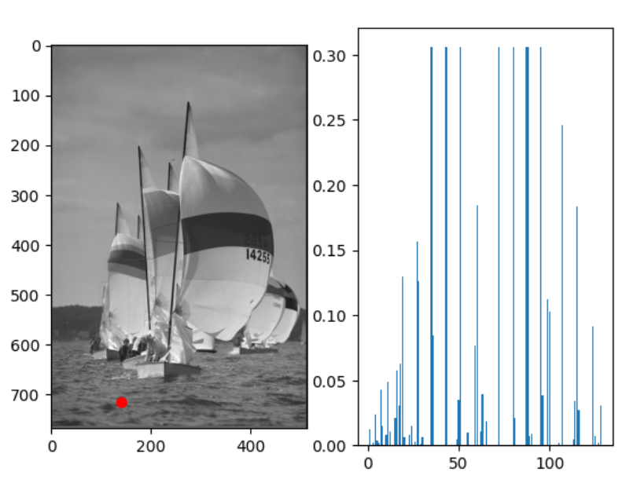
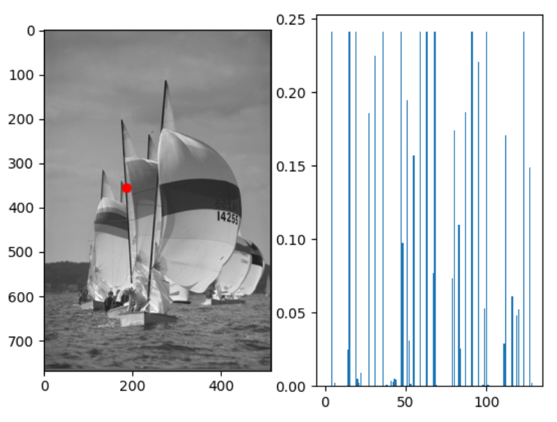
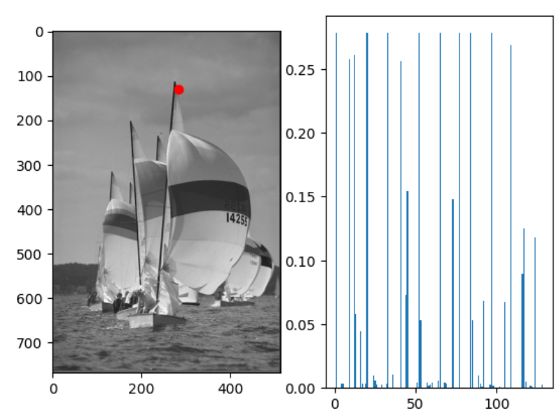
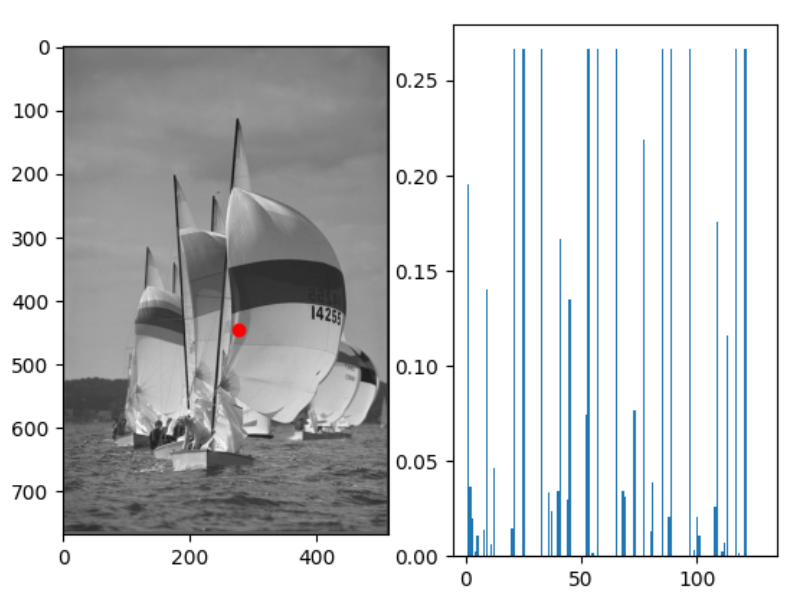

# Harris Detector and SIFT Descriptor

In this project, we implemented a function for Harris corner point detection at a fixed scale. Next, we implement a SIFT Descriptor to extract SIFT descriptor for each Harris corner point found.

## Harris Detector

Specifically, we first implemented a function to generate gaussian filter and derivative of gaussian given the size and std. Next, we implemented a function to find Harris corner point following H = Det(A) − α* Trace(A)^2.

The results are as below:

Finally, we test our function on an image by visualizing Ix, Iy, Harris corner point and Harris values for the entire image. The detected Harris corner points are as below:

## SIFT Descriptor
In this part :

First we implement an atomic histogram function, which will generate a histogram given the quantized orientation and magnitude.

Next, we define a descriptor function, which find the dominant direction from the weighted gradient magnitude and construct 128d SIFT descriptor from the histograms of the splited 4x4 blocks from the 16x16 patches. The descriptor is clipped and normalized.

We combine the histogram and descriptor function to extract SIFT features from the images, and check the correctness of the code by visualizing 10 feature points along with the extracted SIFT features using a bar plot. Some results are as below:

